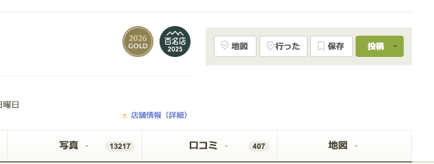

# Tabelog Google Map

食べログの店舗ページに、店舗名で Google マップを開く `地図` ボタンを追加する Tampermonkey 用ユーザースクリプトです。



## ワンクリックインストール

[Tampermonkey にインストール](https://github.com/hannoeru/tabelog-google-map/raw/main/tabelog-google-map.user.js)

## 機能

- 食べログの店舗ページ上部にある操作ボタン列へ `地図` ボタンを追加します。
- Google マップは住所や座標ではなく、店舗名だけで検索します。
- 店舗名はページ内の JSON-LD `Restaurant.name` を優先して取得します。
- `tabelog.com` とそのサブドメイン上でのみ動作します。

開く URL の形式:

```text
https://www.google.com/maps/search/?api=1&query=<店舗名>
```

## インストール

1. ブラウザに Tampermonkey をインストールします。
2. [Tampermonkey にインストール](https://github.com/hannoeru/tabelog-google-map/raw/main/tabelog-google-map.user.js) をクリックします。
3. Tampermonkey の確認画面でインストールします。
4. 食べログの店舗ページを開くと、上部の操作ボタン列に `地図` ボタンが表示されます。

## デバッグ

ブラウザのコンソールで以下を実行すると、デバッグログを有効化できます。

```js
localStorage.setItem('tgmDebug', '1')
location.reload()
```

ログは `[tgm]` で始まります。

無効化する場合:

```js
localStorage.removeItem('tgmDebug')
location.reload()
```

## テスト

ライブの食べログ店舗ページに対して Playwright のスモークテストを実行できます。

```bash
NODE_PATH=/path/to/node_modules node tests/e2e-tabelog-live.mjs
```

任意の店舗 URL を指定する場合:

```bash
TABELOG_E2E_URL='https://tabelog.com/hyogo/A2801/A280101/28057663/' \
NODE_PATH=/path/to/node_modules \
node tests/e2e-tabelog-live.mjs
```

## ライセンス

MIT
